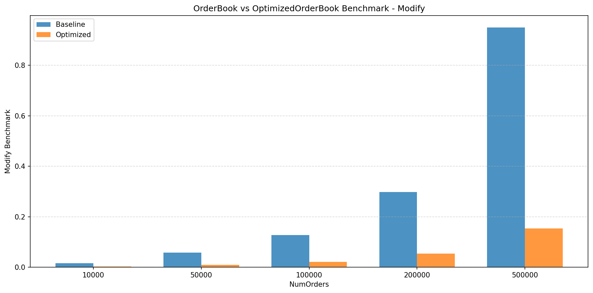
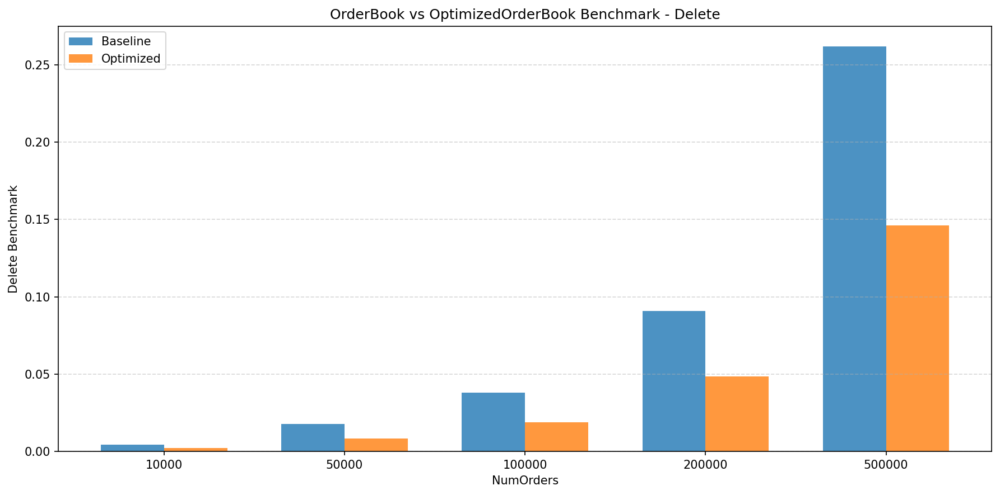
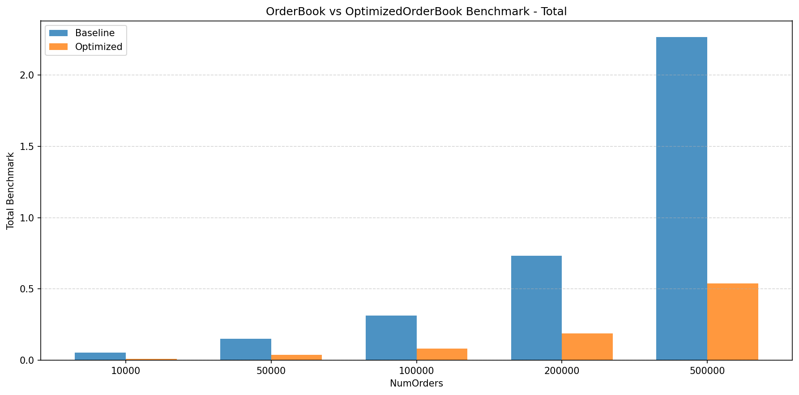
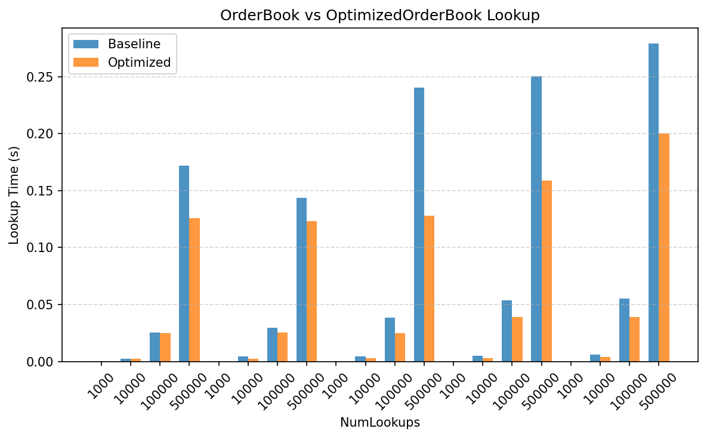

# Phase 5 - HFT OrderBook Optimization

## Step 1 & 2: Performance Analysis & Bottleneck Identification

Run on Apple M1 CPU.

Baseline

```
======== Benchmark Result ========
Insert: 0.530991 s
Modify: 0.459515 s
Delete: 0.140561 s
Total:  1.17571 s
Lookup Test:
  Total lookups: 500000
  Found: 500000
  Total lookup time: 0.412324 s
  Avg lookup latency: 824.649 ns per lookup
```

## Step 3 & 4: Advanced Optimization Techniques

Re-construct orderbook using `std::vector` and get the following testing results:

```
Insert: 0.980931 s
Modify: 0.950215 s
Delete: 0.261923 s
Total:  2.26672 s
Optimized Insert: 0.23838 s
Optimized Modify: 0.153828 s
Optimized Delete: 0.146207 s
[OrderBook] Lookup 1000: 0.000604625 s
[OptimizedOrderBook] Lookup 1000: 0.000431417 s
[OrderBook] Lookup 10000: 0.00590138 s
[OptimizedOrderBook] Lookup 10000: 0.00410592 s
[OrderBook] Lookup 100000: 0.0555398 s
[OptimizedOrderBook] Lookup 100000: 0.0390186 s
[OrderBook] Lookup 500000: 0.279008 s
[OptimizedOrderBook] Lookup 500000: 0.200019 s
```

We can see the optimized order book performs significantly better in the benche mark scenarios.

The following are visualizations of comparisons results:









